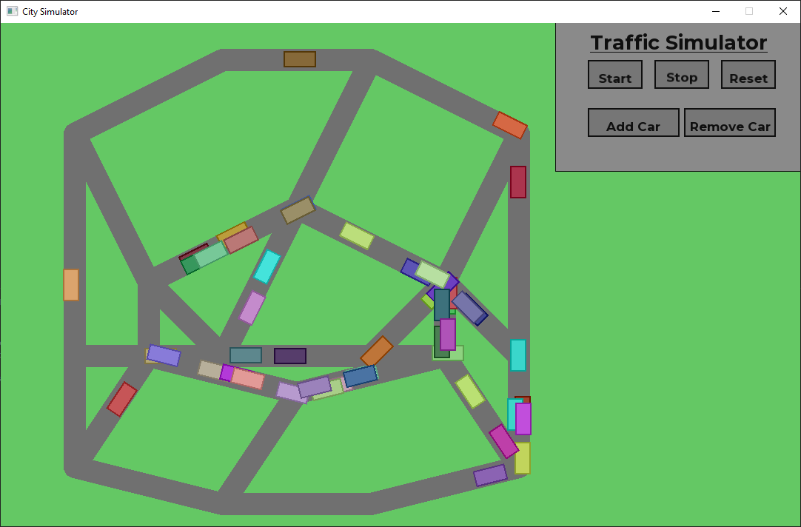
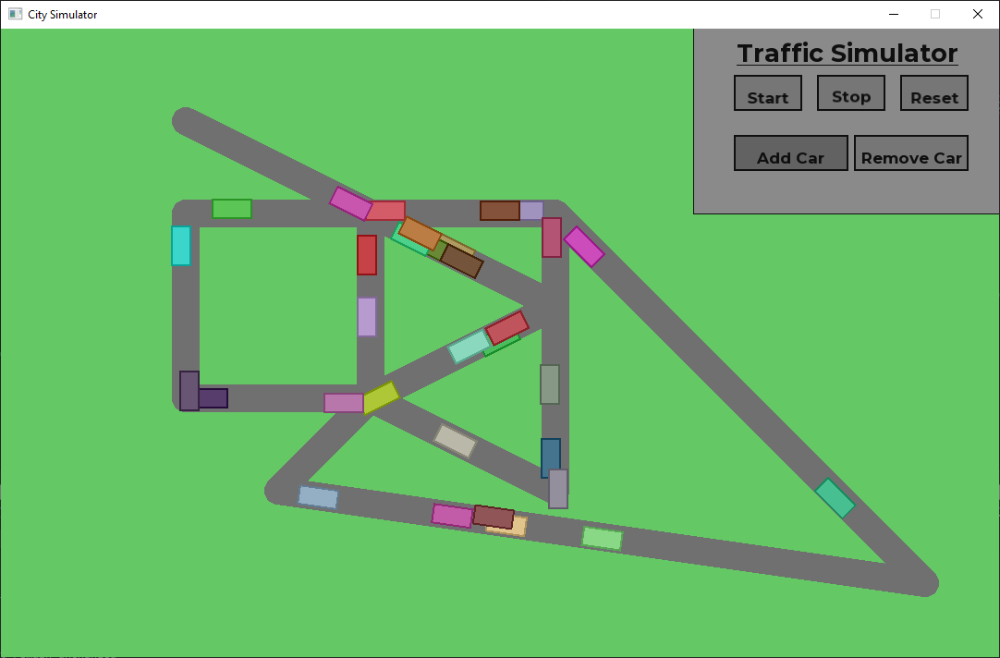

# TC Simulator


Traffic Control Simulator is an open-source tool for simulating city traffic control, to get the optimal setup, to reduce waiting time for everyone, either car drivers or pedestrians.

# About
## 2022 UniHack 🇷🇴

This project was originally ideated and written in the [UniHack](https://unihack.eu/) Hackathon, hosted in Timișoara, Romania, from the 24th to the 27th of November. 

## Track

We chose to develop over the **Smart City**, trying to find the best eco-friendly solution that we could achieve in a short ammount of time.

The first problem we found is that, since we're not from Timișoara, nor from anywhere near, seeing the problems in a city, or how it could be improved becomes sort of a challenge. 

That's how we came up with this project idea: **Traffic Control Simulator**.

## Idea

The main point of this is to create an open-source Simulation Tool, based on cities, to be able to represent traffic situations, and how this could be solved.

## Project

We used mainly **C++** to develop the software, since it's a programming language we're pretty familiar with.

Although it's a challenge to write a full Desktop Application in 48 hours using C++ as our language, we were confident in that we could take it on, and have at least a smal MVP for the project showcase, as a prove of concept.

## Aburrits.dev

This entire project was developed by us, comming from Barcelona, under the name of **Aburrits.dev**. 

This are the names of all 4 of the developers:

- Joaquim Torra Garcia
- Pau Gibert Moreno
- Angel Prat Vilà
- Jorge Borrás i Duarte

# Building

You'll need to have installed:
- g++ v 11.2.0
- SFML library v 2.5.1

## Linux

Build the project to try it on your computer by executing the following commands
```shell
cd TCSim
./make.sh
```

And run it with `./TCSim [file].csv`. 

There's a few city examples in the `./Examples` folder.

## Windows

Open the Visual Studio solution under the directory `./TCSim/`.

> This project was built with VS2022, so it's recomended
**
Compile and run the solution. Any issues, address them directly to the developers.

If you're executing from the IDE, for the moment, the easiest way to try different **csv** files is to hard-code them.

# Examples

**./Examples/csv_provaLONDRES.csv** loaded and running.


**./Examples/csv_prova1.csv** loaded and running.

